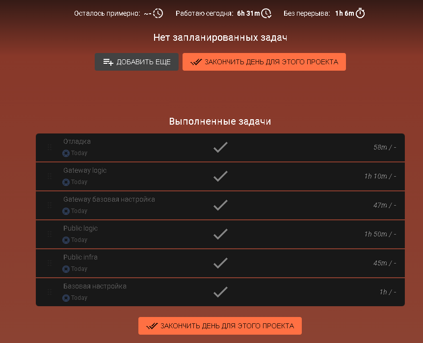

# Description

АПИ для загрузки/получения/редактирования мемов.

Мем состоит из текста и картинки.

Картинки сохраняются в S3 хранилище.

# Запуск

1. `make dev-storages` - запустить PostgreSQL, MinIO
2. `make dev-app` - запустить приложения
3. `make down-all` - закрыть приложения
4. `make down-storages-v` - удалить volume хранилищ

# Описание работы

Проект представляет собой два сервиса: PublicAPI и Gateway.

- PublicAPI - публичное апи для действий с мемами.
- Gateway - закрытое апи для взаимодействия с S3 хранилищем.

Приложения построены с оглядкой на чистую архитектуру.

В каждом выделены слои:

- `domain` - домен
- `logic` - бизнес-логика: use-cases, interactors
- `infra` - репозитории, сервисы (в Gateway отсутствует, т.к. нет необходимости)
- `presentation` - представление

В качестве DI-библиотеки применяется Dishka. Конфигурация описана в каждом проекте в пакете `container`

# Время работы

Работа над основной логикой заняла 6.5 часов.

# Стек

- Python3.11
- FastAPI
- MinIO
- PostgreSQL
- Docker
- SQLALchemy
- alembic
- dishka
- pytest

# Скриншоты

Скриншоты Swagger можно посмотреть в папке `./static/`